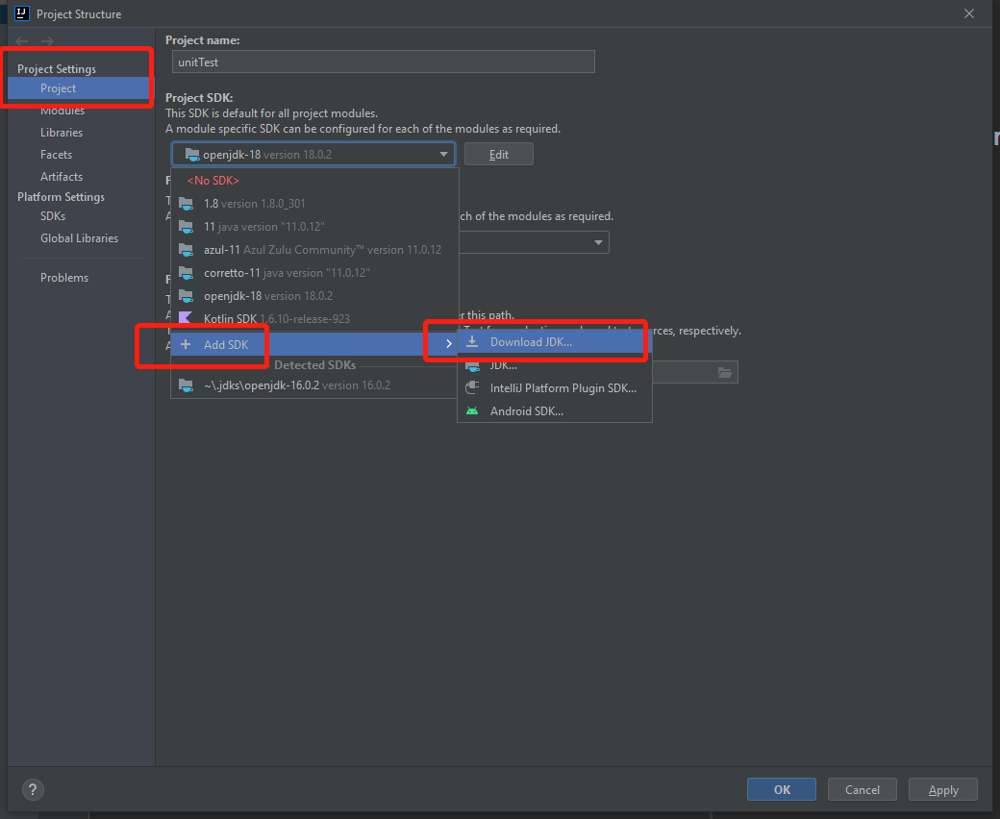

## dependency
JAVA: 18  
gradle: 7+

## change or update your IDE java version(If your version is below 18):
File -> project structure -> project SDK -> add SDK -> download SDK  
For Example:

## tips
If you are first time using this repo, after changed a new branch, please reopen IDEA so that you can load gradle.