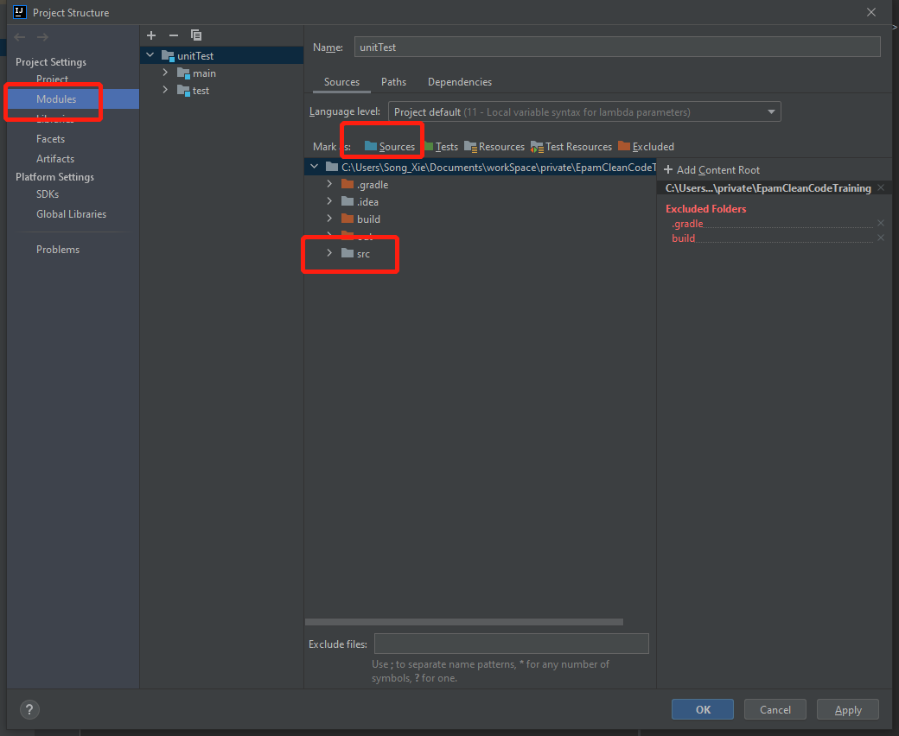
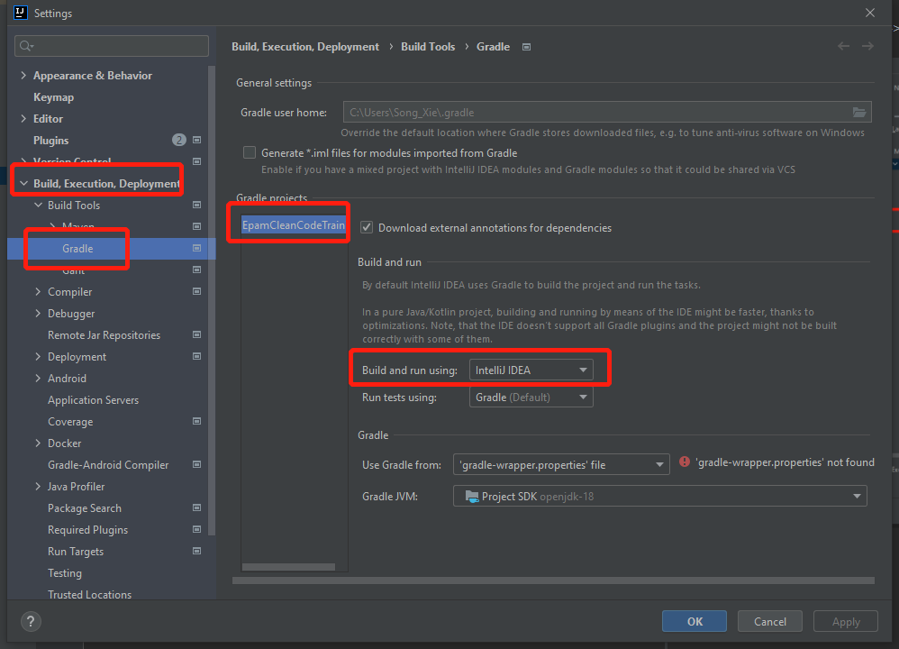

## step1: set src as a sources:
File -> Project structure -> Module -> src -> sources -> apply  
For example:

## step2: run without gradle:
File -> Settings -> Build, Execution, Deployment -> Build Tools -> Gradle -> Build and Run using: Intellij IDEA  
For example:

Tips: please revert this after finish this course.